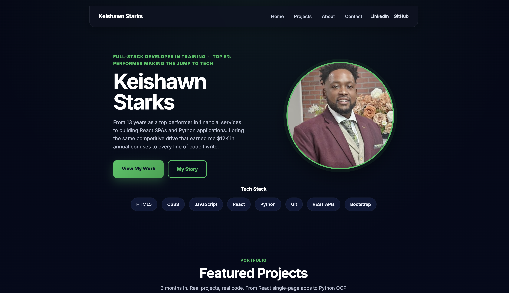

# Keishawn Starks — Personal Portfolio

Live portfolio site built with HTML5, CSS3, and JavaScript. Showcases my growth from a 13-year financial services career into full-stack development.
**Live Site:** [keysstarks.github.io/PersonalPortfolio](https://keysstarks.github.io/PersonalPortfolio)

## Preview

I spent 7 years at Discover Financial and nearly 6 at Bread Financial consistently finishing in the top 5% of my team. In March 2026 I enrolled in Coding Temple's Full-Stack Web Development bootcamp. Six months in, coursework is complete and I'm graduation bound — this portfolio is a living record of that journey.

## Features

- Responsive design across mobile, tablet, and desktop
- Semantic HTML structure with accessibility best practices
- CSS Grid and Flexbox layouts
- Mobile navigation with JavaScript toggle
- Animated section entrances
- Project showcase with tech stack tags, including a flagship deployed project
- Skills, certifications, and career stats

## Site Built With

HTML5 · CSS3 · JavaScript · Flexbox · CSS Grid · Font Awesome · Google Fonts

## Full Tech Stack

**Languages:** HTML5 · CSS3 · JavaScript (ES6+) · TypeScript · Python

**Frameworks & Libraries:** React · React Router · Redux Toolkit · TanStack React Query · Flask · SQLAlchemy · Marshmallow · Axios · Bootstrap

**Databases:** MySQL · PostgreSQL · SQLite · Firebase/Firestore

**Developer Tools:** Git · GitHub · GitHub Actions (CI/CD) · VS Code · Vite · npm · Render · Vercel

**Concepts:** REST APIs · JWT Authentication · CI/CD Pipelines · Object-Oriented Programming · Responsive Design · Debugging · Version Control

## Projects Featured

- **Mechanic Shop API** (flagship) — Deployed Flask REST API with JWT auth, Swagger docs, a 37-test suite, and a GitHub Actions CI/CD pipeline to Render
- **Advanced React E-Commerce Web App** — React + TypeScript e-commerce app with Firebase Auth/Firestore, Redux Toolkit cart state, and React Query, deployed on Vercel
- **E-Commerce REST API** — Flask/SQLAlchemy backend REST API with full CRUD across Users, Products, and Orders
- **Collections Dashboard** — Full-stack app with a Flask/SQLAlchemy/SQLite API and a React + Vite frontend, deployed on Render and Netlify
- **FakeStore API** — React SPA consuming a live REST API with routing and CRUD
- **Defeat the Evil Wizard** — Python OOP RPG with inheritance and game state
- **Python CLI Task Manager** — Persistent task app with file storage and OOP

## Certifications (Coding Temple via Accredible)

- Web Development with HTML & CSS
- JavaScript Mastery
- Python Foundations for Software Engineering
- Advanced Python
- Single Page Apps with React
- Relational Databases & API REST Development
- Advanced Back-End Specialization

## Contact

- Email: keishawnstarks@gmail.com
- GitHub: [KeysStarks](https://github.com/KeysStarks)
- LinkedIn: [keishawn-starks](https://www.linkedin.com/in/keishawn-starks-b35ab0212/)
